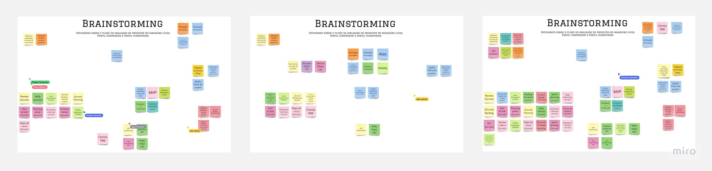
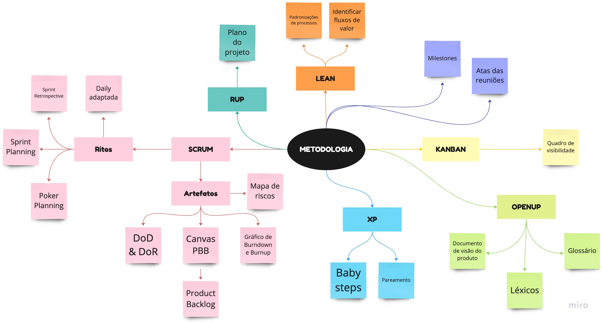
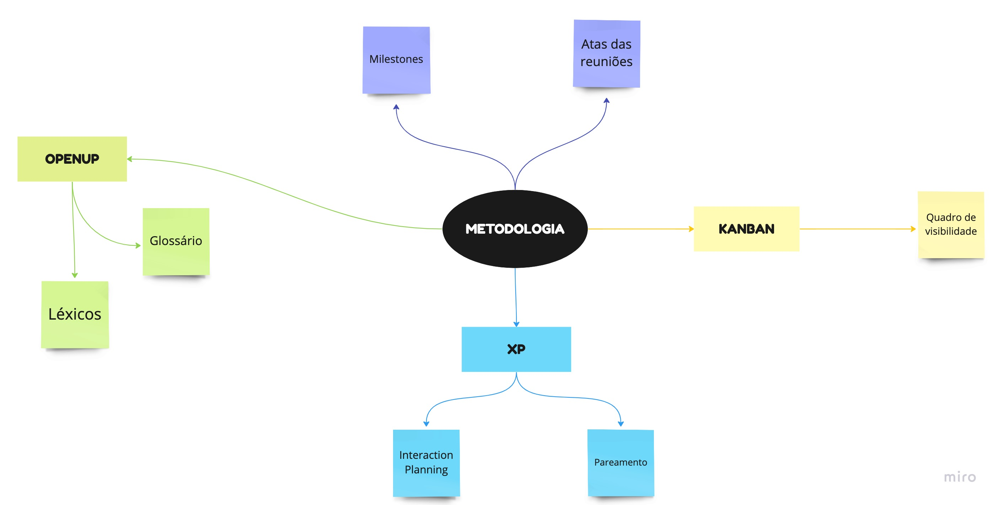
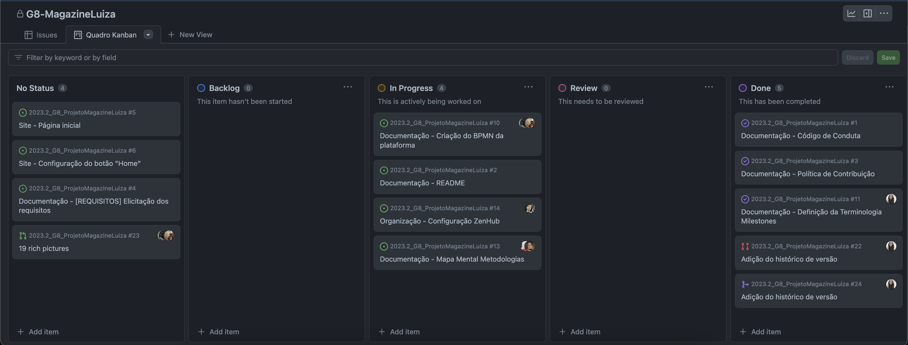

# 1.2. Módulo Processos/Metodologias/Abordagens

## Escolhas Metodológicas

A arquitetura de software desempenha um papel fundamental na construção de sistemas robustos e escaláveis que atendam às necessidades dos usuários e das organizações. Em um mundo em constante evolução tecnológica e competitividade acirrada, a escolha da metodologia adequada para o desenvolvimento de projetos de software torna-se crucial. Neste contexto, será proposto um modelo híbrido de desenvolvimento do projeto, incorporando as melhores práticas e elementos das metodologias Scrum, XP (Extreme Programming), Kanban, OpenUP, RUP (Rational Unified Process) e Lean.

A decisão de abraçar um modelo híbrido nasce da necessidade de adaptar-se às particularidades do projeto em questão. Cada uma das metodologias mencionadas traz consigo valiosas contribuições e princípios, sendo que a combinação estratégica de seus artefatos e ritos se revela a abordagem mais conveniente para alcançar os objetivos estabelecidos.

O primeiro passo para a definição das metodologias foi uma brainstorm *(Figura 1)* e um mapa mental *(Figura 2)* com todos os participantes do grupo, em que cada um destacava os artefatos e ritos metodológicos que contribuiriam no desenvolvimento do projeto.

*Figura 1: Brainstorm confeccionada pelo grupo em 05/09/2023.*

*Figura 2: Mapa mental produzido por Clara Marcelino Ribeiro*

Após essa exposição de ideias, foi feito uma filtragem e priorização dos artefatos e ritos apresentados. O modelo final de metodologias acordado pelo grupo foi sintetizado em um mapa mental *(Figura 3)* para melhor entendimento. Apesar da grande gama de metodologias que surgiram durante a brainstorm, foi optado reduzir os artefatos e ritos sugeridos, dando o foco para os que melhor se encaixam na rotina do desenvolvimento do projeto.

*Figura 3: Mapa mental produzido por Clara Marcelino Ribeiro*

### Extreme programming (XP)

Embora o XP tenha sido originalmente desenvolvido como uma metodologia de desenvolvimento de software, muitos de seus princípios podem ser adaptados para outros tipos de projetos. Essa metodologia será utilizada não apenas nas entregas que resultam em uma implementação de códigos, mas também em todos os artefatos que serão desenvolvidos.

Da Metodologia XP, serão utilizados os seguintes ritos:
- Interaction Planning **⁽¹⁾**, que consiste em uma reunião de planejamento da iteração será realizada no início de cada iteração e irá produzir um plano das atividades que deverão ser realizadas.
- Pareamento **⁽²⁾**: todos os artefatos desenvolvidos deverão ser criados por um par, que trabalharão em conjunto durante o desenvolvimento.

## Kanban

Será aplicada apenas uma parte da metodologia Kanban, que é o quadro de visibilidade **⁽³⁾** para as tarefas desenvolvidas. Este quadro é uma ferramenta que permite acompanhar, organizar e dar transparência às tarefas realizadas ao longo do projeto. Embora a metodologia completa ofereça um conjunto abrangente de diretrizes e práticas, foi considerado que o quadro de visibilidade é a ferramenta mais relevante e valiosa no desenvolvimento do projeto.

A ferramenta utilizada para construção do quadro será o Github **⁽⁴⁾**, no próprio repositório do grupo *(Figura 4)*.

*Figura 4: Quadro Kanban utilizado na disciplina*

## Open Up

O OpenUP (Unified Process), por ser uma adaptação ágil do Rational Unified Process (RUP), aborda a criação de glossários **⁽⁵⁾⁽⁶⁾**, que possuem o objetivo de esclarecer o significado preciso de cada termo, promovendo uma compreensão comum entre todas as partes envolvidas. Para ficar mais completo, também faremos um documento de léxicos, que é um registro formal de termos técnicos ou específicos do site. Esse documento ajuda a garantir que todos envolvidos no projeto compreendam e usem os mesmos termos e conceitos.

### Práticas gerais
Além de tais práticas citadas, também faremos:

- Atas das Reuniões: serão registrados detalhadamente e documentados as discussões, decisões, ações e tópicos abordados durante reuniões de equipe. As atas servem como um registro histórico das atividades e contribuem para uma comunicação eficaz.

- Milestones (Marcos): São pontos específicos no cronograma de um projeto que representam eventos significativos ou metas importantes. No contexto do projeto, as milestones serão baseadas nas datas de entregas de cada módulo.

## Modelagem BPMN

## Referências
- [1] WELLS, D. Iteration Planning. Disponível em: <http://www.extremeprogramming.org/rules/iterationplanning.html>. Acesso em: 11 set. 2023
- [2] WELLS, D. Pair Programming. Disponível em: <http://www.extremeprogramming.org/rules/pair.html>. Acesso em: 11 set. 2023
- [3] KIROVSKA, N.; KOCESKI, S. USAGE OF KANBAN METHODOLOGY AT SOFTWARE DEVELOPMENT TEAMS. [s.l: s.n.]. Disponível em: <https://eprints.ugd.edu.mk/14949/1/030302.pdf>. Acesso em: 11 set. 2023
- [4] Sobre projects (classic). Disponível em: <https://docs.github.com/pt/issues/organizing-your-work-with-project-boards/managing-project-boards/about-project-boards>. Acesso em: 11 set. 2023.
‌- [5] VideoAula - DSW-Metodologia - OpenUp. Disponível em: <https://unbbr-my.sharepoint.com/personal/mileneserrano_unb_br/_layouts/15/stream.aspx?id=%2Fpersonal%2Fmileneserrano%5Funb%5Fbr%2FDocuments%2FArqDSW%20%2D%20V%C3%ADdeosOriginais%2F03c%20%2D%20VideoAula%20%2D%20DSW%2DMetodologia%20%2D%20OpenUp%2Emp4&ga=1>. Acesso em 12 set. 2023.
- [6] VideoAula - DSW-Base - Glossario Lexico. Disponível em: <https://unbbr-my.sharepoint.com/personal/mileneserrano_unb_br/_layouts/15/stream.aspx?id=%2Fpersonal%2Fmileneserrano%5Funb%5Fbr%2FDocuments%2FArqDSW%20%2D%20V%C3%ADdeosOriginais%2F02g%20%2D%20VideoAula%20%2D%20DSW%2DBase%20%2D%20Glossario%20Lexico%2Emp4&ga=1>. Acesso em 12 set. 2023.