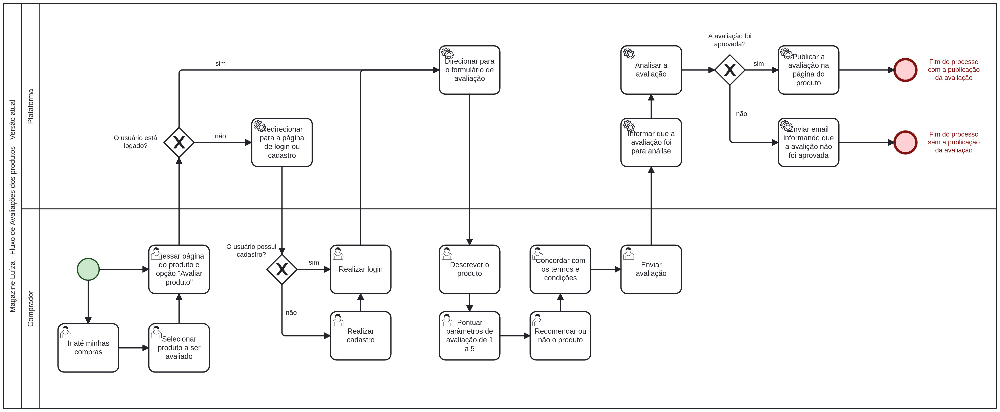
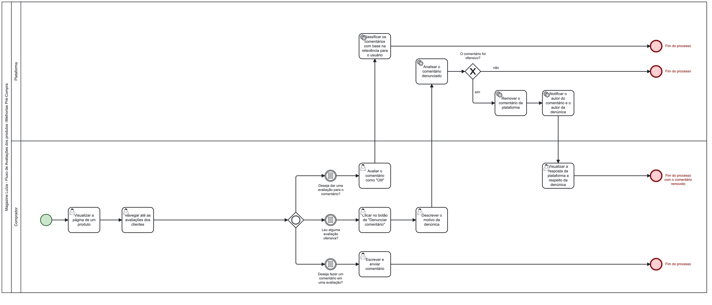
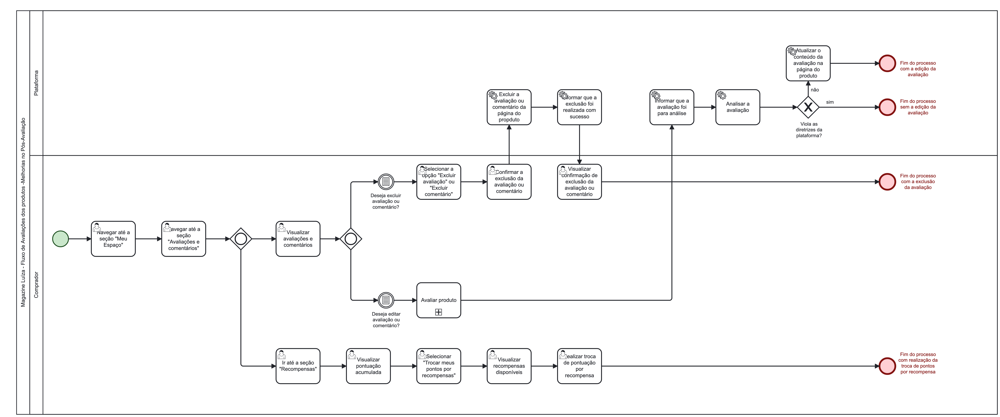
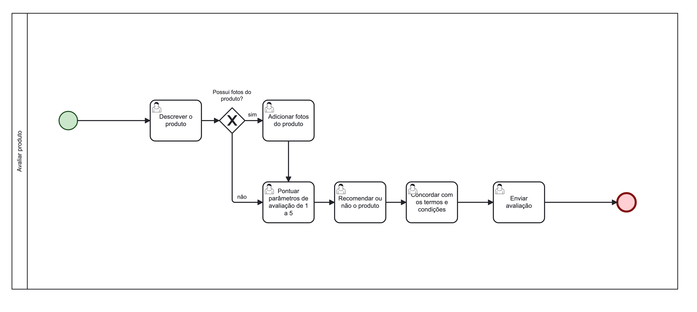

# BPMN

## 1. Introdução

O BPMN (Business Process Managemente Notation) é uma metodologia utilizada para representar processos de forma visual e compreensível através de uma notação gráfica padronizada.
A principal vantagem do BPMN é sua capacidade de comunicar de forma eficaz como um processo funciona, tornando mais fácil para os analistas e stakeholders entenderem e colaborarem dentro de uma organização.

Neste documento, apresentamos os diagramas de fluxo BPMN compreendidos nas avaliações dos produtos na plataforma do e-commerce do <a href="https://magazineluiza.com.br/">Magazine Luiza</a>.

## 2. Metodologia

Tendo como base os conhecimentos explanados em sala, a equipe utilizou o Discord para as reuniões de confecção dos BPMN, que foram produzidos na plataforma <a href="https://modeler.cloud.camunda.io/">Camunda.io</a>.

Foram confeccionados 4 fluxos BPMN. O primeiro, se refere ao fluxo de avaliação atual da plataforma. Os seguintes se referem a fluxos denominados como "pré-compra", "avaliação" e "pós-avaliação", e se compreendem o fluxo atual acrescido de melhorias/novas features elicitadas pela equipe e/ou correções no fluxo atual.

## 3. BPMN da Plataforma - Versão atual da plataforma

A seguir, na Figura 1, apresentamos o diagrama BPMN elaborado a partir da observação do fluxo de avaliação de produtos na plataforma.

Figura 1: BPMN da Plataforma - Versão atual.

## 4. BPMN do Produto - Versão com adição de melhorias elicitadas para o projeto

A seguir, apresentamos os diagramas BPMN que compreendem as sugestões de melhorias e adição de novas features para a plataforma dentro do fluxo estudado.

### 4.1. BPMN da Plataforma - Melhorias Pré-compra

A Figura 2 representa o fluxo das atividades anteriores ao envio de uma avaliação, ou seja, a visualização do produto e suas avaliações anteriores, entre outras atividades.

Figura 2: BPMN da Plataforma - Melhorias Pré-compra.

### 4.2. BPMN da Plataforma - Melhorias na Avaliação

A Figura 3 representa o fluxo referente às atividades envolvidas no processo de avaliação de um produto.

Figura 3: BPMN da Plataforma - Melhorias na Avaliação.

### 4.3. BPMN da Plataforma - Melhorias Pós-Avaliação

A Figura 4 representa o fluxo das atividades que acontecem a partir do envio de uma ou mais avaliações de produtos.

Figura 4: BPMN da Plataforma - Melhorias Pós-Avaliação.

### 4.4. BPMN da Plataforma - Subprocesso Avaliar produto

A Figura 5 representa o subprocesso de "Avaliar produto", que foi referenciado tanto no fluxo de Melhorias na Avaliação quanto no fluxo de Melhorias Pós-Avaliação.

Figura 5: BPMN da Plataforma - Subprocesso Avaliar produto.

## 5. Referências Bibliográficas

> Instituto Serzedello Corrêa. Curso de mapeamento de processos de trabalho com BPMN e Bizagi - Aula 2. Disponível em: <https://portal.tcu.gov.br/lumis/portal/file/fileDownload.jsp?fileId=8A8182A24F0A728E014F0B27E6D51C6C>. Acesso em: 12 set. de 2023.

> SERRANO, Milene. Arquitetura e Desenho de Software: AULA - Notação BPMN. Disponível em: <https://aprender3.unb.br/course/view.php?id=19535>. Acesso em: 12 set. de 2023.

> BPMN. Wiki Arquitetura e Desenho de Software - 2023.1_G3_ProjetoMercadoLivre. Disponível em: <https://unbarqdsw2023-1.github.io/2023.1_G3_ProjetoMercadoLivre/#/Base/BPMN>. Acesso em: 12 set. de 2023.

## 6. Histórico de versionamento

|    Data    | Versão |      Descrição       |                   Autor(a)                    |                   Revisor(a)                    |
| ---------- | ------ | -------------------- | --------------------------------------------- | ----------------------------------------------- |
| 11/09/2023 |  1.0   | Criação do documento | [Gabrielly Assunção](https://github.com/GabriellyAssuncao) | [Charles Serafim](https://github.com/charles-serafim) |
| 12/09/2023 |  1.1   | Adição da introdução | [Gabrielly Assunção](https://github.com/GabriellyAssuncao) | [Charles Serafim](https://github.com/charles-serafim) |
| 12/09/2023 |  1.2   | Confecção do BPMN atual da plataforma | [Charles Serafim](https://github.com/charles-serafim), [Gabrielly Assunção](https://github.com/GabriellyAssuncao), [Laís Ramos](https://github.com/laisramos123) | [Thiago Cerqueira](https://github.com/Thiago-Cerq) |
| 12/09/2023 |  1.3   | Adição da metodologia e referências | [Charles Serafim](https://github.com/charles-serafim) |[Laís Ramos](https://github.com/laisramos123)|
| 12/09/2023 |  1.3   | Adição da imagem do BPMN do produto | [Laís Ramos](https://github.com/laisramos123) | [Charles Serafim](https://github.com/charles-serafim) |
| 14/09/2023 |  1.4   | Confecção do BPMN das melhorias | [Charles Serafim](https://github.com/charles-serafim), [Clara Ribeiro](https://github.com/clara-ribeiro), [Gabrielly Assunção](https://github.com/GabriellyAssuncao), [Laís Ramos](https://github.com/laisramos123), [Thiago Cerqueira](https://github.com/Thiago-Cerq) | Grupo |
| 14/09/2023 |  1.5   | Adição do BPMN das melhorias | [Charles Serafim](https://github.com/charles-serafim) | [Thiago Cerqueira](https://github.com/Thiago-Cerq) |
| 14/09/2023 |  1.6   | Adição do subprocesso de avaliação | [Clara Ribeiro](https://github.com/clara-ribeiro) | [Charles Serafim](https://github.com/charles-serafim) |
