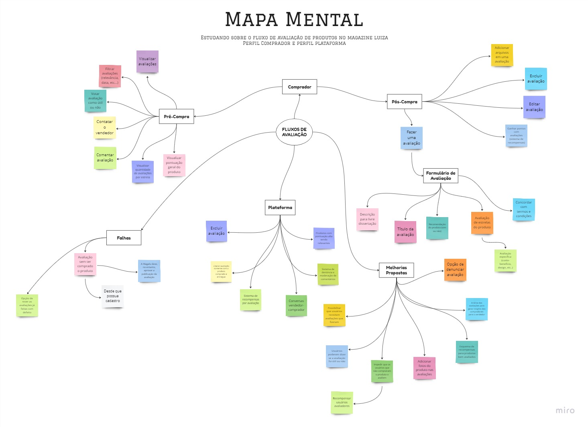

# Mapa Mental

## 1. Introdução

&emsp;&emsp; O mapa mental é uma técnica de organização de ideias que permite que as ideias sejam organizadas de forma hierárquica, de modo que as ideias mais gerais fiquem para o centro e as ideias mais específicas fiquem para as extremidades. O mapa mental foi feito pensando em elucidar e deixar de maneira mais visual as características do fluxo de avaliação de um produto dentro do Magazine Luiza, pelo perfil de Comprador e Plataforma. Pela parte de Comprador, dividimos em duas áreas: o pós-compra e o pré-compra.

## 2. Mapa mental

&emsp;&emsp; Abaixo consta o mapa mental elaborado pela equipe utilizando como base de ideias o [Brainstorm](./Base/Brainstorm.md).

<em>
Mapa Mental dos Fluxos
Autores: Iago e Brunna
</em>

## 3. Histórico de Versão

| Data       | Versão | Modificação      | Autor      | Revisor |
|------------|--------|------------------|------------|---------|
| 13/09/2023 | 0.1    | Criação a página | Iago Matos | -       |
