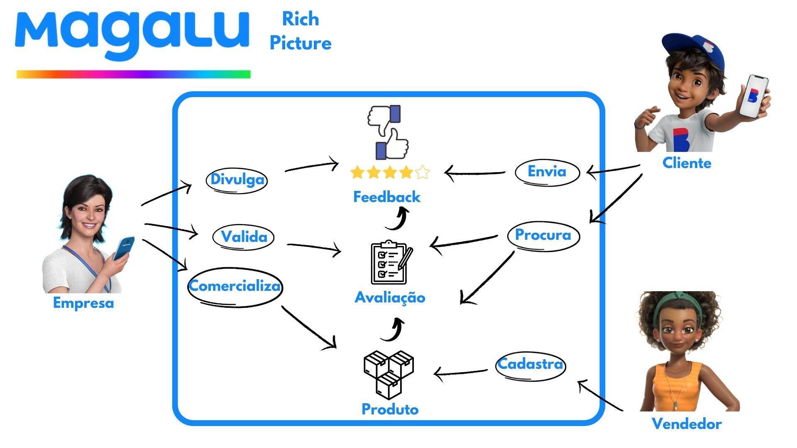

# Rich Picture

## 1. Introdução

O rich picture é uma representação visual que consegue capturar de forma eficaz sistemas, processos e problemas complexos. Sua grande vantagem está na capacidade de transmitir informações de maneira clara e detalhada.
Isso resulta em uma compreensão mais acessível e abrangente das circunstâncias, o que é muito vantajoso em contextos que envolvem colaboração e trabalho em equipe.

Neste documento, apresentamos os rich pictures elaborados para ilustrar a relação entre os atores e sistema envolvidos nos fluxos compreendidos nas avaliações dos produtos na plataforma do e-commerce do <a href="https://magazineluiza.com.br/">Magazine Luiza</a>.

## 2. Metodologia, elementos e legendas

Os rich pictures foram elaborados por duas duplas participantes do projeto e teve como base a observação da plataforma. Na Tabela 1, apresentamos os elementos utilizados para a confecção dos rich pictures:

### 2.1. Legenda do Rich Picture Versão 1.1

| Elemento | Figura | Descrição |
| -------- | ------ | --------- |
| Ator | | Pessoas, grupos ou entidades que desempenham um papel no sistema. |
| Dados |  | Informações relevantes que fluem pelo sistema / objetos das operações dos atores. |
| Flechas |  | Relações e interações entre diferentes elementos. Fluxos de informações, influências, ações ou comunicação. |
| Operações |  | Atividades ou ações que os atores realizam no sistema. |
| Limites do Sistema |  | Fronteira do contexto do sistema, define o que está dentro e fora da análise. |

Tabela 1: Legendas dos elementos do rich picture ver 1.1 

### 2.2. Legenda do Rich Picture Versão 2.1

| Elemento | Figura | Descrição |
| -------- | ------ | --------- |
| Ator | | Pessoas, grupos ou entidades que desempenham um papel no sistema. |
| Dados |  | Informações relevantes que fluem pelo sistema / objetos das operações dos atores. |
| Flechas |  | Relações e interações entre diferentes elementos. Fluxos de informações, influências, ações ou comunicação. |
| Operações |  | Atividades ou ações que os atores realizam no sistema. |
| Limites do Sistema |  | Fronteira do contexto do sistema, define o que está dentro e fora da análise. |

Tabela 1: Legendas dos elementos do rich picture versão 2.1 

## 3. Rich Picture

### 3.1. Rich Picture Versão 1.1
 
 
 

Fonte: Imagem 1 - Rich picture magalu versão 1.1 

### 3.2. Rich Picture Versão 2.1
 
 
 

Fonte: Imagem 2 - Rich picture magalu versão 2.1 

## 4. Conclusão
A elaboração de duas versões diferentes do Rich Picture  proprociona à equipe diferentes pontos de vista acerca dos fluxos percorridos para a avaliação de produtos. Com esses artefatos em mão, foi possível analisar pontos fortes e fracos desse fluxo e a possibilidade de novas features e possíveis melhorias.

## 5. Referências Bibliográficas

> SERRANO, Milene. Arquitetura e Desenho de Software: AULA - Projeto e desenho de software. Disponível em: <https://aprender3.unb.br/course/view.php?id=19535>. Acesso em: 13 set. de 2023.

> Rich Picture. Wiki Arquitetura e Desenho de Software - iGado. Disponível em: <https://unbarqdsw.github.io/2020.1_G13_iGado/#/docs/Product/DesignSprint/RichPicture>. Acesso em: 13 set. de 2023.

> Rich Picture. Wiki Arquitetura e Desenho de Software - 2023.1_G3_ProjetoMercadoLivre. Disponível em: <https://unbarqdsw2023-1.github.io/2023.1_G3_ProjetoMercadoLivre/#/Base/Rich-picture>. Acesso em: 13 set. de 2023.

> Rich Picture. Wiki Arquitetura e Desenho de Software - Projeto Ri Happy - Grupo 4. Disponível em: <https://unbarqdsw2023-1.github.io/2023.1_G4_ProjetoRiHappy/#/Base/1.1.1.4.RichPicture>. Acesso em: 13 set. de 2023.

## 6. Histórico de versionamento

|    Data    | Versão |      Descrição       |                   Autor(a)                    |                   Revisor(a)                    |
| ---------- | ------ | -------------------- | --------------------------------------------- | ----------------------------------------------- |
| 11/09/2023 |  1.0   | Criação do documento | [Charles Serafim](https://github.com/charles-serafim) | [Thiago Cerqueira](https://github.com/Thiago-Cerq) |
| 11/09/2023 |  1.1   | Confecção dos rich pictures iniciais | [Charles Serafim](https://github.com/charles-serafim), [Gabrielly Assunção](https://github.com/GabriellyAssuncao), [Laís Ramos](https://github.com/laisramos123), [Thiago Cerqueira](https://github.com/Thiago-Cerq) | zz
| 11/09/2023 |  1.2   | Adição do Rich Picture Ver 2.1 | [Thiago Cerqueira](https://github.com/Thiago-Cerq) | [Gabrielly Assunção](https://github.com/GabriellyAssuncao) |
| 12/09/2023 |  1.3   | Adição da introdução | [Gabrielly Assunção](https://github.com/GabriellyAssuncao) | [Charles Serafim](https://github.com/charles-serafim) |
| 12/09/2023 |  1.4   | Adição da metodologia | [Charles Serafim](https://github.com/charles-serafim) | [Thiago Cerqueira](https://github.com/Thiago-Cerq) |
| 12/09/2023 |  1.5   | Adição do RichPicture Ver 1.1 e Legenda do 2.1  | [Thiago Cerqueira](https://github.com/Thiago-Cerq) | [Laís Ramos](https://github.com/laisramos123) | 
| 12/09/2023 |  1.6   | Correção de links do RichPicture e adição da conclusão | [Laís Ramos](https://github.com/laisramos123) | [Gabrielly Assunção](https://github.com/GabriellyAssuncao) |
| 13/09/2023 |  1.7   | Adição das Referências Bibliográficas | [Charles Serafim](https://github.com/charles-serafim) | [Thiago Cerqueira](https://github.com/Thiago-Cerq) |
| 13/09/2023 |  1.8   | Adição da nova versão do RichPicture 01 |  [Laís Ramos](https://github.com/laisramos123) |[Thiago Cerqueira](https://github.com/Thiago-Cerq) |
| 13/09/2023 |  1.9   | Adição da nova versão do RichPicture 02 |[Thiago Cerqueira](https://github.com/Thiago-Cerq) |[Laís Ramos](https://github.com/laisramos123) |