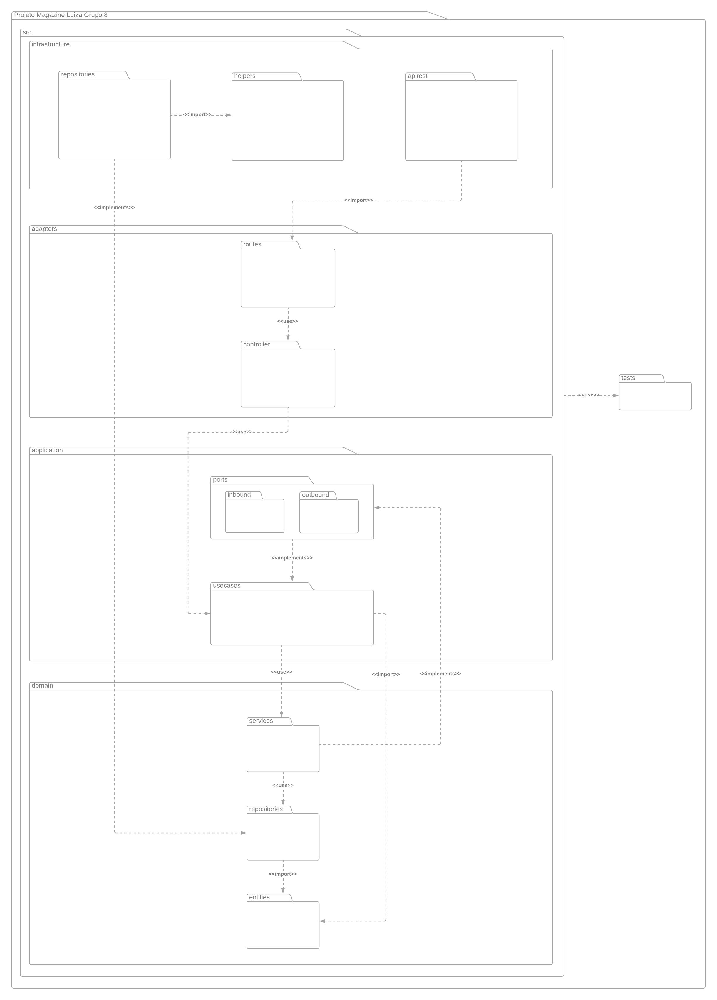

# Diagrama de Pacotes

## 1. Introdução

Um diagrama de pacotes UML é uma representação gráfica com o objetivo de organizar e estruturar elementos de um sistema de software em grupos lógicos chamados de "pacotes".

O principal objetivo de um diagrama de pacotes UML é fornecer uma visão de alto nível da organização do sistema, mostrando como os diferentes componentes estão agrupados e interconectados. Isso ajuda os desenvolvedores e stakeholders a compreender a arquitetura do sistema, facilitando a comunicação e o planejamento do projeto.

## 2. Metodologia
O artefato foi conduzido utilizando previamente a ferramenta do Google Meet para reunião dos alinhamentos de responsabilidades e, para a modelagem, foi utilizada a ferramenta Lucidchart. A fim de tornar a interpretação do sistema mais digerível, foram criados três diagramas de pacotes, um dando uma visão micro da implementação do sistema frontend, outro dando uma visão micro do sistema backend e por fim um último diagrama que apresenta a visão macro dos sistema front e backend relacionados entre si.

## 3. Diagrama de Pacote - Visão Micro Frontend (v1.0)

O diagrama indica a estrutura do projeto, sendo divida em features, onde cada feature possui as seguintes camadas: infra, data, domain, presentation. Essa estrutura possui diversas classes abstratas, o que entra em acordo com a pasta de testes onde o criamos mocks e stubs a partir delas. A arquitetura do projeto será a _Clean Architecture_, filosofia para design de software, ela separa os elementos do software em anéis de acesso. 
Isso tem como objetivo organizar o código a fim de encapsular as regras de negócio. A principal regra dessa metodologia de design é que anéis mais externos podem ter conhecimento de anéis internos, porém o inverso não é verdade, dessa forma, camadas internas, não conhecem funções/ métodos de camadas externas. 
Outro ponto que vale destaque é de que, cada feature é encapsulada e dessa forma pode ser facilmente usada em outros projetos. Contudo existem alguns dados usados em todas as features e para isso o grupo utilizou da pasta shared, onde esses componentes sem disponibilizados sem grande acoplação com regras de negócio.

### Infra

Camada que faz o intermédio com à api do sistema ou outro serviço externo fora da aplicação. Possui a responsabilidade de fazer a request e receber o dado "cru" sem nenhuma tratativa.

### Data

Camada responsável por tratar o dado adquirido pela infra e passá-lo ao domínio já estruturado como é requisitado. Caso o dado não esteja como esperado, será essa camada que levantará uma exceção que irá ser tratada no domínio da aplicação. Além disso, ela pode fazer o papel inverso modelando o dado do nosso domínio para serviços externos.

### Domain

Camada encapsulado do sistema frontend que não é afetada por mudanças fora dessa camada (com exceções de mudanças na regra do negócio). Nessa camada que é definida os usecases, entidades e falhas específicas do domínio. No caso de necessidade de vários usecases pode-se criar uma rotina que faz uso de um agrupamento de usecases.

### Presentation

Camada de apresentação de dados modelados para o usuário. Conta com três pastas: state_mng, components e pages. A primeira tem como objetivo gerenciar os estados de interação relevantes para aplicação. A segunda camada, tem como objetivo otimizar o reúso de código criando componentes que são compartilhadas pelas páginas. A última camada, representa as diversas páginas que serão apresentadas ao usuário durante determinado fluxo.

## 3.2. Diagrama de Pacote - Visão Micro Backend (v1.0)

O diagrama foi modelado baseado na Arquitetura Hexagonal (Portas e Adaptadores), no qual consiste em criar sistemas de software mais flexíveis, testáveis e de fácil manutenção, através da separação clara entre o núcleo da aplicação e os adaptadores que lidam com as interações externas.

### Infrastructure

A camada de Infraestrutura é responsável por lidar com as preocupações relacionadas à interação com recursos externos, como bancos de dados, sistemas de arquivos, serviços web, APIs externas e outros componentes externos, além de definir a estrutura interna das APIs da aplicação.

### Adapters

A camada de Adaptadores desempenha um papel fundamental na separação entre a lógica de negócios da aplicação e a comunicação com o mundo externo, incluindo interfaces de usuário, serviços externos e recursos de infraestrutura. Será a camada responsável por ligar a API interna com as regras de negócio do sistema.

### Application

A camada de Aplicação é responsável por orquestrar os casos de uso da aplicação. Ela atua como um intermediário entre a camada de adaptadores e a camada de domínio, garantindo que as solicitações externas sejam devidamente direcionadas para a lógica de negócios apropriada na camada de domínio e que as respostas sejam retornadas corretamente aos adaptadores externos. Esse intermédio entre as duas camadas acontece em dentro da aplicação mas em um nível de abstração superior, no subpacote de portas.

### Domain

A camada de Domínio é o núcleo da aplicação e concentra-se na modelagem e na implementação da lógica de negócios. É onde as regras de negócios são definidas e onde os conceitos centrais do domínio da aplicação são representados.

## 4. Referências

> UML Package Diagrams Overview. <bold>uml-diagrams.org<bold>. Disponível em: [https://www.uml-diagrams.org/package-diagrams-overview.html](https://www.uml-diagrams.org/package-diagrams-overview.html). Acesso em 27 de Sep de 2023.

> AQEEL Abdul. <bold>Flutter Clean Architecture Series<bold>. Medium, 2021. Disponível em: [https://devmuaz.medium.com/flutter-clean-architecture-series-part-1-d2d4c2e75c47](https://devmuaz.medium.com/flutter-clean-architecture-series-part-1-d2d4c2e75c47). Acesso em 27 de Sep de 2023.

> Idealo Tech Blog. Hexagonal Ports & Adapters Architecture. Medium, 2020. Disponível em: https://medium.com/idealo-tech-blog/hexagonal-ports-adapters-architecture-e3617bcf00a0. Acesso em: 04 de Out de 2023.

## 5. Histórico de Versão

| Data       | Versão | Modificação                                                                                | Autor                                                                                                         |
| ---------- | ------ | ------------------------------------------------------------------------------------------ | ------------------------------------------------------------------------------------------------------------- |
| 29/09/2023 | 0.1    | Adição do diagrama de pacote micro frontend                                               | [Mauricio Machado](https://github.com/MauricioMachadoFF)                                                      |
| 29/09/2023 | 0.2    | Adição do diagrama de pacote macro, adição de referências, correção de índices no arquivo | [Guilherme Barbosa](https://github.com/guibrbs)   [Mauricio Machado](https://github.com/MauricioMachadoFF) |
| 04/10/2023 | 0.3    | Adição do diagrama de pacote micro backend                 | [Guilherme Barbosa](https://github.com/guibrbs)
