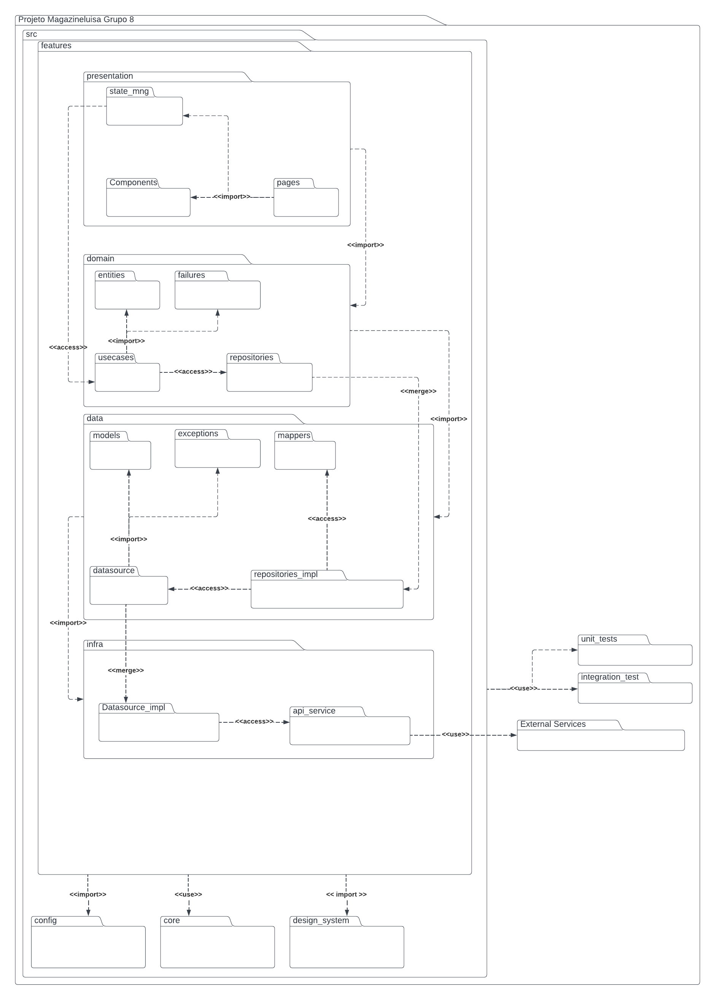

# 2.2.1. Notação UML – Diagramas Estáticos

**Foco_01:** Modelagem UML Estática

Entrega Mínima: 1 Modelo Estático (ESCOPO: Diagrama de Classes; Diagrama de Pacotes; Diagrama de Componentes ou Diagrama de Implantação).

Apresentação (em sala) explicando o modelo estático especificado, com: (i) rastro claro aos membros participantes (MOSTRAR QUADRO DE PARTICIPAÇÕES & COMMITS); (ii) justificativas & senso crítico sobre o modelo; (iii) breve apresentação do modelo estático elaborado, e (iv) comentários gerais sobre o trabalho em equipe. Tempo da Apresentação: +/- 5min. Recomendação: Apresentar diretamente via Wiki ou GitPages do Projeto.

A Wiki ou GitPages do Projeto deve conter um tópico dedicado ao Módulo Notação UML – Diagrama Estático, com 1 modelo, histórico de versões, referências, e demais detalhamentos gerados pela equipe nesse escopo.

# 1. Introdução

# 2. Diagrama de Pacotes

Um diagrama de pacotes UML é uma representação gráfica com o objetivo de organizar e estruturar elementos de um sistema de software em grupos lógicos chamados de "pacotes".

O principal objetivo de um diagrama de pacotes UML é fornecer uma visão de alto nível da organização do sistema, mostrando como os diferentes componentes estão agrupados e interconectados. Isso ajuda os desenvolvedores e stakeholders a compreender a arquitetura do sistema, facilitando a comunicação e o planejamento do projeto.

A seguir o grupo irá apresentar os diagramas de pacotes desenvolvidos. A fim de tornar a interpretação do sistema mais digerível, foram criados três diagramas de pacotes, um dando uma visão micro da implementação do sistema frontend, outro dando uma visão micro do sistema backend e por fim um último diagrama que apresenta a visão macro dos sistema front e backend relacionados entre si.

## 2.1. Diagrama de Pacote - Visão Micro Frontend (v1.0)

O diagrama indica a estrutura do projeto, sendo divida em features, onde cada feature possui as seguintes camadas: infra, data, domain, presentation. Essa estrutura possui diversas classes abstratas, o que entra em acordo com a pasta de testes onde o criamos mocks e stubs a partir delas. A arquitetura do projeto será a _Clean Architecture_, filosofia para design de software, ela separa os elementos do software em anéis de acesso. 
Isso tem como objetivo organizar o código a fim de encapsular as regras de negócio. A principal regra dessa metodologia de design é que anéis mais externos podem ter conhecimento de anéis internos, porém o inverso não é verdade, dessa forma, camadas internas, não conhecem funções/ métodos de camadas externas. 
Outro ponto que vale destaque é de que, cada feature é encapsulada e dessa forma pode ser facilmente usada em outros projetos. Contudo existem alguns dados usados em todas as features e para isso o grupo utilizou da pasta shared, onde esses componentes sem disponibilizados sem grande acoplação com regras de negócio.

### Infra

Camada que faz o intermédio com à api do sistema ou outro serviço externo fora da aplicação. Possui a responsabilidade de fazer a request e receber o dado "cru" sem nenhuma tratativa.

### Data

Camada responsável por tratar o dado adquirido pela infra e passá-lo ao domínio já estruturado como é requisitado. Caso o dado não esteja como esperado, será essa camada que levantará uma exceção que irá ser tratada no domínio da aplicação. Além disso, ela pode fazer o papel inverso modelando o dado do nosso domínio para serviços externos.

### Domain

Camada encapsulado do sistema frontend que não é afetada por mudanças fora dessa camada (com exceções de mudanças na regra do negócio). Nessa camada que é definida os usecases, entidades e falhas específicas do domínio. No caso de necessidade de vários usecases pode-se criar uma rotina que faz uso de um agrupamento de usecases.

### Presentation

Camada de apresentação de dados modelados para o usuário. Conta com três pastas: state_mng, components e pages. A primeira tem como objetivo gerenciar os estados de interação relevantes para aplicação. A segunda camada, tem como objetivo otimizar o reúso de código criando componentes que são compartilhadas pelas páginas. A última camada, representa as diversas páginas que serão apresentadas ao usuário durante determinado fluxo.

<!-- ## 2.2. Diagrama de Pacote - Visão Micro Backend(v1.0) -->

<!-- TODO(gui): Adicionar diagrama de pacote backend micro e explicar as camadas -->

## 2.3. Diagrama de Pacote - Visão Macro(v1.0)

Esse diagrama apresenta como as visões micro se comportariam no escopo do grupo 8. Assim temos uma visão da implementação do fluxo de avaliação de produtos. 

<!-- Visão Fronted -->

Na parte do frontend, tem-se a criação da pasta shared com entidades, casos de uso e repositórios comuns a todo o projeto, apesar de apenas isso ser mostrada demais camadas e artefatos das pastas existem, porém o grupo optou por não se aprofundar nessa implementação no diagrama de pacotes a fim de deixar o diagrama simples e de fácil entendimento.

Além da pasta mencionada, existem 4 pastas relativas a features que possuem relação direta ou indireto com o fluxo de avaliação do produto. As features são: account_management (gerenciamento de conta, que conta com 3 subfeatures), product_explorer (exploração de produto), product_purchase (compra de produto), product_review (avaliação de produto) e report_review (denúncia de avaliação). Cada feature ou subfeature possui sua conexão com o backend do sistema.

<!-- TODO(gui): Contextualizar aqui sobre a parte do backend nisso -->

# 3. Referências

- [1] UML Package Diagrams Overview. <bold>uml-diagrams.org<bold>. Disponível em: [https://www.uml-diagrams.org/package-diagrams-overview.html](https://www.uml-diagrams.org/package-diagrams-overview.html). Acesso em 27 de Sep de 2023.
- [2] AQEEL Abdul. <bold>Flutter Clean Architecture Series<bold>. Medium, 2021. Disponível em: [https://devmuaz.medium.com/flutter-clean-architecture-series-part-1-d2d4c2e75c47](https://devmuaz.medium.com/flutter-clean-architecture-series-part-1-d2d4c2e75c47). Acesso em 27 de Sep de 2023.

# 4. Histórico de Versões

| Data       | Versão | Modificação                                                                                | Autor                                                                                                         |
| ---------- | ------ | ------------------------------------------------------------------------------------------ | ------------------------------------------------------------------------------------------------------------- |
| 29/09/2023 | 0.1    | Adição dos diagrama de pacote micro frontend                                               | [Mauricio Machado](https://github.com/MauricioMachadoFF)                                                      |
| 29/09/2023 | 0.2    | Adição dos diagrama de pacote macro, adição de referências, correção de índices no arquivo | [Guilherme Barbosa](https://github.com/guibrbs)   [Mauricio Machado](https://github.com/MauricioMachadoFF) |
