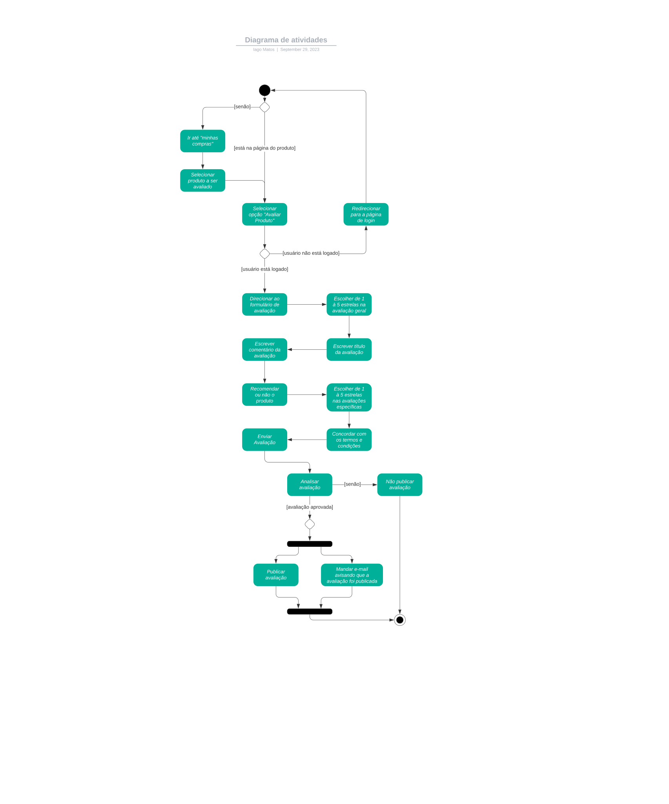

# Diagrama de Atividades

## 1. Introdução

&emsp;&emsp; O diagrama de atividades é um diagrama que representa o fluxo de trabalho de um sistema. Ele mostra o fluxo de um processo, incluindo atividades e ações executadas pelos componentes do sistema (humanos ou não), os objetos usados por essas ações e as relações entre essas atividades e objeto, sendo um diagrama de comportamento que mostra o fluxo de controle ou o fluxo de objetos com ênfase na sequência e condições de tempo. Podem ser usados para processos de negócio, sistemas de software ou qualquer outro processo que envolva atividades.

## 2. Metodologia

&emsp;&emsp; Tendo como base os conteúdos ministrados por vídeo aula pela professora, o diagrama foi elaborado primeiramente pela plataforma [draw.io](https://app.diagrams.net/), e posteriormente explorado mais no plataforma [Lucidchart](https://www.lucidchart.com/), onde foi possível aprimorar o diagrama e deixá-lo mais claro e legível.

## 3. Diagrama de Atividades

&emsp;&emsp; A seguir, na figura 1, está apresentada a primeira versão do Diagrama de Atividades, que usa como base nosso [BPMN](./Base/BPMN.md) em seu fluxo base, sem as melhorias.

<em>
Mapa Mental dos Fluxos
Autor: Iago de Sousa
</em>

## 4. Referências

> SERRANO, Milene. Arquitetura e Desenho de Software: AULA - Diagrama de Atividades. Disponível em: <https://unbbr-my.sharepoint.com/:v:/g/personal/mileneserrano_unb_br/Ed9k-OvMH7hMlNMj6CGVenMBSyeVrDBOdg84Czx_aHI9gw?e=ZzFF4A>. Acesso em: 29 set. de 2023.

> O que é diagrama de atividades UML?. Lucidchart, ano desconhecido. Disponível em: <https://www.lucidchart.com/pages/pt/o-que-e-diagrama-de-atividades-uml>. Acesso em: 29 set. de 2023.

> Diagrama de atividades. Wikipedia, 2019. Disponível em: <https://pt.wikipedia.org/wiki/Diagrama_de_atividades>. Acesso em: 29 set. de 2023.

## 5. Histórico de Versão

| Data       | Versão | Modificação                               | Autor      | Revisor |
|------------|--------|-------------------------------------------|------------|---------|
| 13/09/2023 | 0.1    | Primeira versão do Diagrama de Atividades | Iago Matos | -       |
