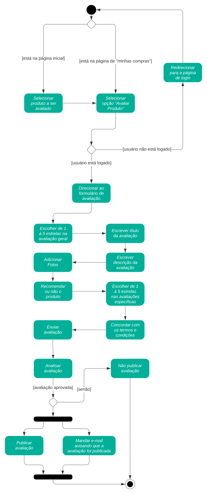
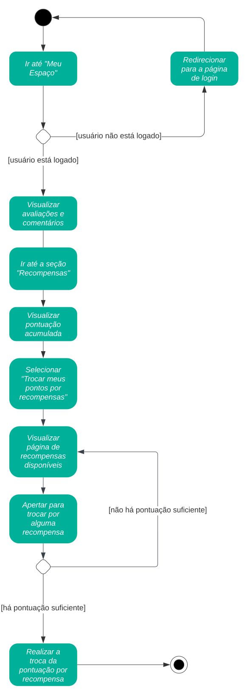
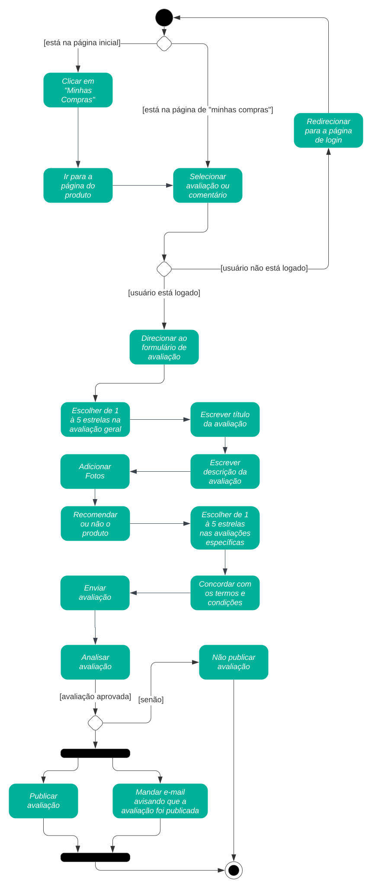

# Diagrama de Atividades

## 1. Introdução

&emsp;&emsp; O diagrama de atividades é um diagrama que representa o fluxo de trabalho de um sistema. Ele mostra o fluxo de um processo, incluindo atividades e ações executadas pelos componentes do sistema (humanos ou não), os objetos usados por essas ações e as relações entre essas atividades e objeto, sendo um diagrama de comportamento que mostra o fluxo de controle ou o fluxo de objetos com ênfase na sequência e condições de tempo. Podem ser usados para processos de negócio, sistemas de software ou qualquer outro processo que envolva atividades.

## 2. Metodologia

&emsp;&emsp; Tendo como base os conteúdos ministrados por vídeo aula pela professora, o diagrama foi elaborado primeiramente pela plataforma [draw.io](https://app.diagrams.net/), e posteriormente explorado mais no plataforma [Lucidchart](https://www.lucidchart.com/), onde foi possível aprimorar o diagrama e deixá-lo mais claro e legível.

## 3. Diagrama de Atividades

&emsp;&emsp; Nesta seção, serão apresentadas diferentes partes do diagrama de atividades, tendo como base o diagrama base, e em seguida as melhorias separadamente, no final, será apresentado o diagrama completo com todas as melhorias. Todos os diagramas utilizam o mesmo BPMN como base, que pode ser visto [aqui](./Base/BPMN.md).

## 3.1. Diagrama base

&emsp;&emsp; A seguir, na figura 1, está apresentada a primeira versão do Diagrama de Atividades, que usa como base nosso [BPMN](./Base/BPMN.md) em seu fluxo base, onde a única melhoria é a adição de fotos. Vale ressaltar que, na data atual (Outubro de 2023), o Magazine Luiza permite que seja mandada avaliação de um produto mesmo sem ter comprado ele, portanto, não há essa verificação nesse diagrama.

<em>
Figura 1: Diagrama de Atividades 
Autor: Iago de Sousa
</em>

### 3.2. Melhoria 1: Exclusão de comentários e avaliações

&emsp;&emsp; A segunda melhoria pode ser vista em um diagrama à parte, onde o fluxo se refere à exclusão de um comentário ou avaliação, como pode ser visto na figura 4.

<em>
Figura 2: Diagrama de Atividades: Exclusão de comentários e avaliações 
Autor: Iago de Sousa
</em>

### 3.3. Melhoria 2: Recompensas

&emsp;&emsp; A terceira melhoria pode ser vista em um diagrama à parte, onde o fluxo se refere à seção de recompensas do aplicativo, onde o usuário pode resgatar seus pontos por recompensas, como pode ser visto na figura 3.

<em>
Figura 3: Diagrama de Atividades: Sistema de recompensas 
Autor: Iago de Sousa
</em>

### 3.4. Melhoria 3: Edição de comentários e avaliações

&emsp;&emsp; A quarta melhoria pode ser vista em um diagrama à parte, onde o fluxo se refere à edição de um comentário ou avaliação, como pode ser visto na figura 4. Este fluxo é semelhante ao fluxo de adição de comentários e avaliações, porém com algumas nuances no meio do processo.

<em>
Figura 4: Diagrama de Atividades: Edição de comentários e avaliações 
Autor: Iago de Sousa
</em>

### 3.5. Melhoria 4: Interações com comentários e avaliações

&emsp;&emsp; A quinta melhoria pode ser vista em um diagrama à parte, onde o fluxo se refere à interação com comentários e avaliações, como pode ser visto na figura 5. Este fluxo se refere às atividades de marcar o comentário como útil, e assim poder classificar com relevância de maneira mais fiel; de responder a um comentário, para que o usuário possa tirar dúvidas com outros usuários; e de denunciar um comentário, para que o usuário possa denunciar comentários que não estejam de acordo com as regras do site.

<em>
Figura 5: Diagrama de Atividades: Interações com comentários e avaliações 
Autor: Iago de Sousa
</em>

## 5. Conclusão

&emsp;&emsp; O diagrama de atividades é uma ferramenta muito útil para a modelagem de processos, pois permite que sejam visualizados os fluxos de maneira mais clara e objetiva, permitindo que sejam feitas melhorias e otimizações no processo. Além disso, o diagrama de atividades é uma ferramenta que pode ser usada em qualquer processo, não apenas em processos de software, como pode ser visto na seção 1. É muito parecida com o BPMN, tendo o formato mais parecido com o fluxograma e caminho mais visíveis e simples, podendo ser usada de maneira mais lúdica do que o BPMN, porém podendo demonstrar fluxos de maneira muito semelhante.

## 6. Referências

> SERRANO, Milene. Arquitetura e Desenho de Software: AULA - Diagrama de Atividades. Disponível em: <https://unbbr-my.sharepoint.com/:v:/g/personal/mileneserrano_unb_br/Ed9k-OvMH7hMlNMj6CGVenMBSyeVrDBOdg84Czx_aHI9gw?e=ZzFF4A>. Acesso em: 29 set. de 2023.

> O que é diagrama de atividades UML?. Lucidchart, ano desconhecido. Disponível em: <https://www.lucidchart.com/pages/pt/o-que-e-diagrama-de-atividades-uml>. Acesso em: 29 set. de 2023.

> Diagrama de atividades. Wikipedia, 2019. Disponível em: <https://pt.wikipedia.org/wiki/Diagrama_de_atividades>. Acesso em: 29 set. de 2023.

## 7. Histórico de Versão

| Data       | Versão | Modificação                                     | Autor      | Revisor          |
|------------|--------|-------------------------------------------------|------------|------------------|
| 29/09/2023 | 0.1    | Primeira versão do Diagrama de Atividades       | Iago Matos | Maurício Machado |
| 02/10/2023 | 0.2    | Segunda versão do Diagrama + melhoria 1         | Iago Matos |                  |
| 02/10/2023 | 0.3    | Terceira versão do Diagrama + melhorias 2, 3, 4 | Iago Matos |                  |
