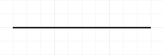

# Diagrama de Casos de Uso

## 1. Histórico de Versões

| Data       | Versão | Descrição                                         | Autor(a)                                                                                               | Revisor(a)                                            |
| :--------: | :----: | :-----------------------------------------------: | :----------------------------------------------------------------------------------------------------: | :---------------------------------------------------: |
| 27/09/2023 | 1.0    | Criação do documento, introdução                  | [Charles Serafim](https://github.com/charles-serafim)                                                  | [Laís Ramos](https://github.com/laisramos123)         |
| 28/09/2023 | 1.1    | Adição da Metodologia                             | [Laís Ramos](https://github.com/laisramos123)                                                          | [Lucas Rodrigues](https://github.com/lucascard)       |
| 28/09/2023 | 1.2    | Adição dos Casos de Uso                           | [Charles Serafim](https://github.com/charles-serafim), [Lucas Rodrigues](https://github.com/lucascard) | [Laís Ramos](https://github.com/laisramos123)         |
| 28/09/2023 | 1.3    | Descrições dos Casos de Uso e BDD                 | [Lucas Rodrigues](https://github.com/lucascard)                                                        | [Charles Serafim](https://github.com/charles-serafim) |
| 01/10/2023 | 1.4    | Criação e adição do Diagrama de Casos de Uso      | [Charles Serafim](https://github.com/charles-serafim), [Laís Ramos](https://github.com/laisramos123)   | [Lucas Rodrigues](https://github.com/lucascard)       |
| 03/10/2023 | 1.5    | Adição da tabela de identificação de dependências | [Charles Serafim](https://github.com/charles-serafim)                                                  | - |

## 2. Introdução

Diagramas de modelagem dinâmica mostram o comportamento de objetos em um sistema, segundo Fakhroutdinov (2023). A respeito dos Diagramas de Casos de Uso, o autor os define como a descrição de um conjunto de ações (casos de uso) que um ou mais sistemas (assunto) devem ou podem realizar juntamente a um ou mais usuários externos do sistema (atores). Cada caso de uso deve prover resultados observáveis e valiosos aos atores ou outros stakeholders do sistema.

Outros autores descrevem ainda o Diagrama de Casos de Uso como o diagrama mais geral e informal da notação UML, sendo utilizado normalmente nas fases de levantamento e análise de requisitos do sistema (GUEDES, 2009). A ideia principal é identificar atores (usuários, outro sistema etc) que utilizarão o software de alguma forma, assim como as funções que o sistema disponibilizará aos atores, que são os casos de uso. O autor destaca ainda que o Diagrama de Casos de Uso deve ter uma linguagem simples e de fácil compreensão para os usuários terem uma ideia geral a respeito do comportamento do sistema.

No presente documento, apresentamos os Diagramas de Casos de Uso modelados a respeito do sistema do site <a href="magazineluiza.com.br/">Magazine Luiza</a>.

## 3. Detalhamento Metodológico

A confecção do Diagrama de Casos de Uso foi realizada utilizando a ferramenta <a href="https://www.lucidchart.com/pages/pt">Lucid Chart</a> e foram destacados os membros Laís Ramos, Charles Serafim e Lucas Rodrigues. Esses serão os mesmos que farão o artefato referente ao Diagrama de Implantação. A  disposição em questão seguiu as recomendações dadas em sala de aula. Vale destacar que para a confecção do diagrama, o trio se baseou na documentação e padronização prevista pela Linguagem de Modelagem Unificada (UML) e na documentação diponibilizada pela professora.

### 3.1. Componentes e símbolos

Um diagrama de casos de uso é composto pelos elementos descritos a seguir:

#### Atores

Representam os usuários e sistemas envolvidos nas interações e comulmente são representados por bonecos palito.

Figura 1: Representação gráfica utilizada para os Atores.
 

#### Cenário

Sequência de eventos que acontecem quando um usuário interage com o sistema. Geralmente é representado por uma caixa. Todos os casos de uso fora da caixa são considerados fora do escopo do sistema.

Figura 2: Representação gráfica utilizada para os Cenários.

#### Caso de uso

Caso de uso é uma ação ou funcionalidade realizada pelo usuário. A forma mais utilizada para representar casos de uso é a forma oval horizontal, onde cada forma representa um caso de uso diferente que o usuário pode ter. Por representarem ações, recomenda-se o uso de verbos no infinitivo para descrevê-los.

Figura 3: Representação gráfica utilizada para os Casos de Uso.

#### Relacionamentos

São utilizados para representar, por meio de setas legendadas, as interações entre os atores e os casos de uso e entre casos de uso. Existem alguns tipos, dentre eles:

<a href="https://www.ibm.com/docs/pt-br/rsas/7.5.0?topic=diagrams-relationships-in-use-case"><b>Associação: </b></a>Relacionamento entre ator e caso de uso. Ajuda a compreender quais são as ações que podem ser realizadas por aquele determinado ator.

  
* Notação no diagrama:

Figura 4: Representação gráfica utilizada para o relacionamento de associação.

<a href="https://www.ibm.com/docs/pt-br/rsas/7.5.0?topic=diagrams-relationships-in-use-case"><b>Inclusão: </b></a>Tipo de relacionamento que proporciona um caso de uso (o caso de uso base) incluir a funcionalidade de outro caso de uso (o caso de uso de inclusão). O relacionamento de inclusão permite a reutilização da funcionalidade em um modelo de caso de uso.

  
* Notação no diagrama: <<*includes*>>

Figura 5: Representação gráfica utilizada para o relacionamento de inclusão.

<a href="https://www.ibm.com/docs/pt-br/rsas/7.5.0?topic=diagrams-relationships-in-use-case" width="200"><b>Extensão: </b></a>São utilizadps para especificar que um caso de uso (extensão) estende o comportamento de outro caso de uso (base). Este tipo revela detalhes sobre um sistema ou aplicativo que normalmente estão ocultos em um caso de uso.

* Notação no diagrama: <<*extends*>>

Figura 6: Representação gráfica utilizada para o relacionamento de extensão.

<a href="https://www.ibm.com/docs/pt-br/rsas/7.5.0?topic=diagrams-relationships-in-use-case"><b>Generalização: </b></a>Este relacionamento indica uma relação de generalização/especialização. A seta parte do objeto específico para o geral, ou seja, do objeto que possui as mesmas características que o geral, porém possui características específicas particulares. Pode ser utilizado para relacionar casos de uso entre si e também para relacionar tipos de atores.

  
* Notação no diagrama:

Figura 7: Representação gráfica utilizada para o relacionamento de generalização.

### 3.2. BDD - Behavior Driven Development

O BDD(Desenvolvimento Orientado a Comportamento) é uma abordagem que se concentra em definir o comportamento de um sistema a partir da perspectiva do usuário final. Ele é usado para criar cenários de teste em linguagem natural, descrevendo as condições iniciais, as ações do usuário e os resultados esperados.

No contexto de modelagem de casos de uso, o BDD é usado para especificar detalhadamente como um caso de uso deve funcionar em diferentes situações.

## 4. Diagrama de Casos de Uso

Nas próximas seções, apresentamos a lista de casos de uso, os diagramas referentes aos mesmos e as suas respectivas especificações.

### 4.1. Especificação dos Casos de Uso

#### 4.1.1. Identificação dos Casos de Uso

Na Tabela 1, apresentamos uma lista dos casos de uso identificados no projeto.

<table align="center">
    <tr>
        <th>Código</th>
        <th>Caso de Uso</th>
        <th>Descrição</th>
        <th>BDD</th>
    </tr>
    <tr>
        <td>UC-01</td>
        <td>Escrever avaliação</td>
        <td>Permite que usuários registrados escrevam avaliações de produtos.</td>
        <td>Dado que o usuário esteja na página de avaliações de um produto Quando clicar em Escrever avaliação E preencher todos os campos obrigatórios  E clicar em Enviar Avaliação Então a avaliação deve ser enviada para análise E posteriormente aprovada ou não</td>
    </tr>
    <tr>
        <td>UC-02</td>
        <td>Visualizar avaliação</td>
        <td>Permite que os usuários visualizem as avaliações de um produto na página do produto.</td>
        <td></td>
    </tr>
    <tr>
        <td>UC-03</td>
        <td>Editar avaliação</td>
        <td>Permite que os usuários editem avaliações que eles já escreveram anteriormente.</td>
        <td></td>
    </tr>
    <tr>
        <td>UC-04</td>
        <td>Excluir avaliação</td>
        <td>Permite que os usuários excluam suas próprias avaliações de produtos.</td>
        <td></td>
    </tr>
    <tr>
        <td>UC-05</td>
        <td>Recomendar avaliação</td>
        <td>Permite que os usuários recomendem avaliações escritas por outros usuários.</td>
        <td></td>
    </tr>
    <tr>
        <td>UC-06</td>
        <td>Comentar avaliação</td>
        <td>Permite que os usuários adicionem comentários às avaliações de produtos.</td>
        <td></td>
    </tr>
    <tr>
        <td>UC-07</td>
        <td>Denunciar comentário</td>
        <td>Permite que os usuários denunciem comentários inapropriados feitos por outros usuários.</td>
        <td></td>
    </tr>
    <tr>
        <td>UC-08</td>
        <td>Filtrar avaliações por classificação</td>
        <td>Permite que os usuários filtrem as avaliações com base em classificações de estrelas.</td>
        <td></td>
    </tr>
    <tr>
        <td>UC-09</td>
        <td>Ordenar avaliações</td>
        <td>Permite que os usuários ordenem as avaliações com base em determinados critérios.</td>
        <td></td>
    </tr>
    <tr>
        <td>UC-10</td>
        <td>Ordenar avaliações por relevância</td>
        <td>Permite que os usuários ordenem as avaliações com base em critérios de relevância.</td>
        <td></td>
    </tr>
    <tr>
        <td>UC-11</td>
        <td>Ordenar avaliações por data</td>
        <td>Permite que os usuários ordenem as avaliações com base na data de publicação.</td>
        <td></td>
    </tr>
    <tr>
        <td>UC-12</td>
        <td>Ordenar por positividade</td>
        <td>Permite que os usuários ordenem as avaliações com base na positividade.</td>
        <td></td>
    </tr>
    <tr>
        <td>UC-13</td>
        <td>Acumular pontos por avaliações</td>
        <td>Recompensa os usuários por escreverem avaliações úteis.</td>
        <td></td>
    </tr>
    <tr>
        <td>UC-14</td>
        <td>Trocar pontos por recompensas</td>
        <td>Permite que os usuários troquem pontos por benefícios ou recompensas.</td>
        <td></td>
    </tr>
</table>

Tabela 1: Lista de Casos de Uso. Autores: Charles Serafim, Laís Ramos e Lucas Rodrigues.

#### 4.1.2. Identificação das dependências

Na Tabela 2, detalhamos os relacionamentos e dependências existentes entre os casos de uso diversos.

<table align="center">
    <tr>
        <th>Casos de Uso</th>
        <th>Relacionamento</th>
    </tr>
    <tr>
        <td>UC-01 X UC-03</td>
        <td>Inclusão</td>
    </tr>
    <tr>
        <td>UC-01 X UC-04</td>
        <td>Inclusão</td>
    </tr>
    <tr>
        <td>UC-02 X UC-05</td>
        <td>Extensão</td>
    </tr>
    <tr>
        <td>UC-02 X UC-06</td>
        <td>Extensão</td>
    </tr>
    <tr>
        <td>UC-02 X UC-07</td>
        <td>Extensão</td>
    </tr>
    <tr>
        <td>UC-02 X UC-08</td>
        <td>Extensão</td>
    </tr>
    <tr>
        <td>UC-09 X UC-10</td>
        <td>Generalização</td>
    </tr>
    <tr>
        <td>UC-09 X UC-11</td>
        <td>Generalização</td>
    </tr>
    <tr>
        <td>UC-09 X UC-12</td>
        <td>Generalização</td>
    </tr>
    <tr>
        <td>UC-13 X UC-14</td>
        <td>Inclusão</td>
    </tr>
</table>

Tabela 2: Identificação das dependências entre casos de uso. Autores: Charles Serafim, Laís Ramos e Lucas Rodrigues.

### 4.2. Diagrama de Casos de Uso

A seguir, na Figura 8, apresentamos o Diagrama de Casos de Uso geral, onde estão representados todos os casos de uso elicitados.

Figura 8: Diagrama de Casos de Uso.

### 4.3. Fluxos de eventos

A seguir, na Figura 8, apresentamos o Diagrama de Casos de Uso geral, onde estão representados todos os casos de uso elicitados.

Figura 8: Diagrama de Casos de Uso.

## 5. Conclusão

## 6. Referências

> GUEDES, Gilleanes T. A. UML 2: Uma abordagem prática. 1. ed. São Paulo: Novatec Editora, 2009. ISBN 978-7522-149-5.

> FAKHROUTDINOV, Kirill. UML. UML 2.5 Diagrams Overview. [S. l.], 2023. Disponível em: https://www.uml-diagrams.org/uml-25-diagrams.html. Acesso em: 27 set. 2023.

> FAKHROUTDINOV, Kirill. UML. Use Case Diagrams. [S. l.], 2023. Disponível em: https://www.uml-diagrams.org/use-case-diagrams.html. Acesso em: 27 set. 2023.

> Relacionamentos em Diagramas de Caso de Uso . Disponível em: https://www.ibm.com/docs/pt-br/rsas/7.5.0?topic=diagrams-relationships-in-use-case