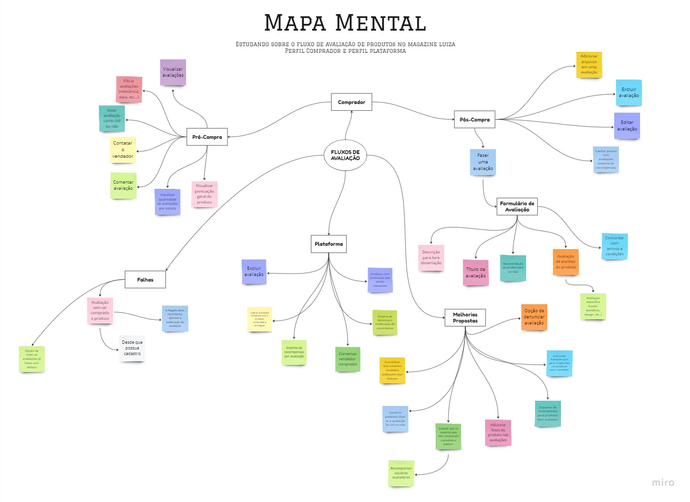
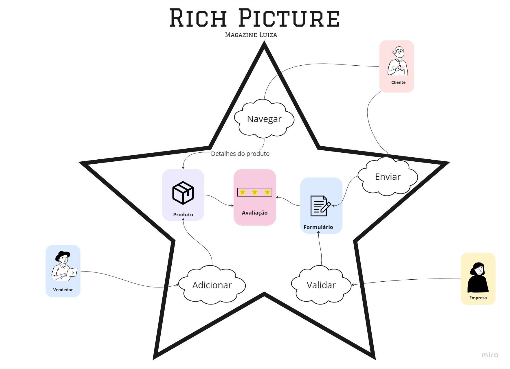
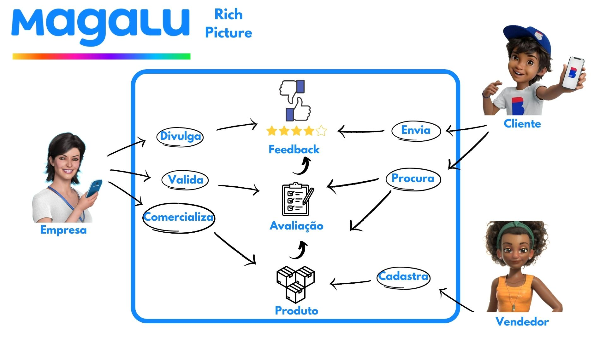
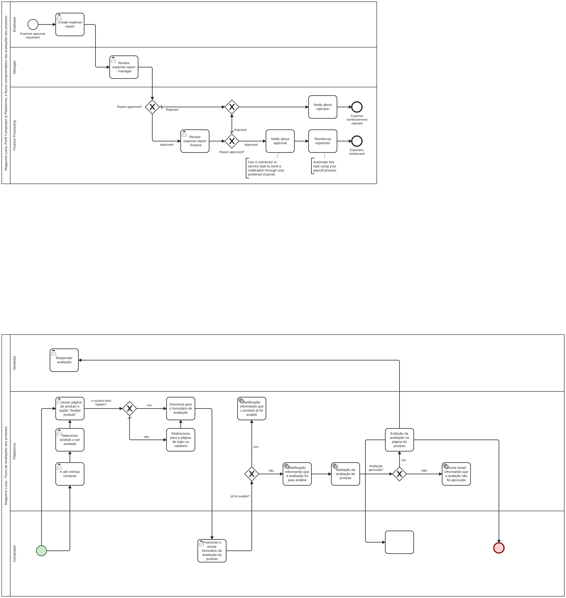
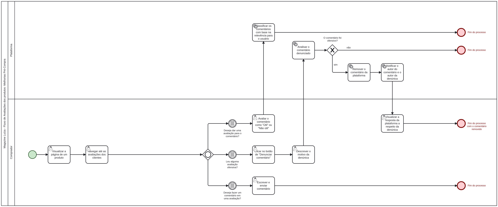
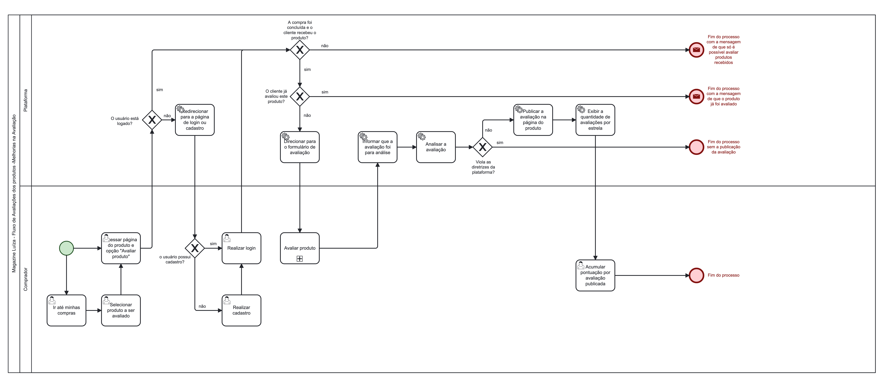
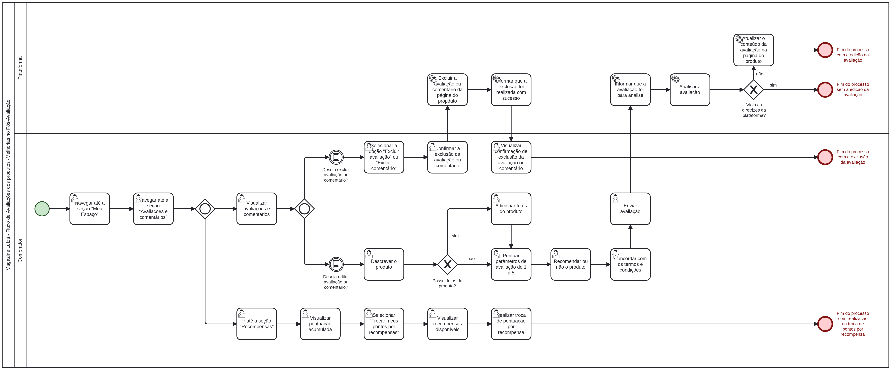
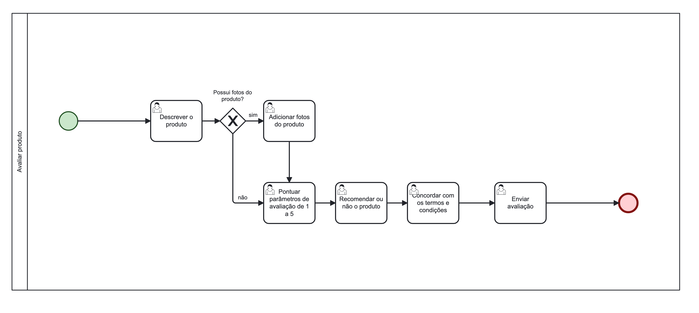

# Projeto Magazine Luiza

**Código da Disciplina**: FGA0208 
**Número do Grupo**: 08 

## Alunos

| Matrícula | Aluno                            |                                                                              Github                                                                              |
| --------- | -------------------------------- | :--------------------------------------------------------------------------------------------------------------------------------------------------------------: |
| 211029156 | Brunna Louise Martins Rocha      |        [@Dbrunna-martins](https://github.com/brunna-martins)       |
| 190113596 | Charles Manrique Serafim Morais  |       [@charles-serafim](https://github.com/charles-serafim)     |
| 200036351 | Clara Marcelino Ribeiro de Sousa |           [@clara-ribeiro](https://github.com/clara-ribeiro)         |
| 200018442 | Gabrielly Assunção Rodrigues     |   [@GabriellyAssuncao](https://github.com/GabriellyAssuncao) |
| 200037994 | Guilherme Barbosa Ferreira       |                       [@guibrbs](https://github.com/guibrbs)                     |
| 202023743 | Iago de Sousa Campelo Matos      |                       [@iagoscm](https://github.com/iagoscm)                     |
| 170107574 | Laís Ramos Barbosa               |             [@laisramos123](https://github.com/laisramos123)           |
| 200059211 | Lucas Rodrigues Cardoso          |                   [@lucascard](https://github.com/lucascard)                 |
| 200041959 | Mauricio Machado Fernandes Filho |   [@MauricioMachadoFF](https://github.com/MauricioMachadoFF) |
| 200025449 | Natan Tavares Santana            |                 [@Neitan2001](https://github.com/Neitan2001)               |
| 190117508 | Thiago Cerqueira Borges          |               [@Thiago-Cerq](https://github.com/Thiago-Cerq)             |

## Sobre

Este projeto faz parte da disciplina de Arquitetura de Software da Universidade de Brasília, ministrada pela Professora Milene Serrano. Ele tem como foco a análise da arquitetura de software do site Magazine Luiza, uma das maiores varejistas online do Brasil. O Magazine Luiza é uma plataforma de comércio eletrônico que oferece uma ampla gama de produtos, desde eletrônicos e eletrodomésticos até móveis e itens de decoração.

Nossa análise se concentra especificamente no estudo do "Perfil Comprador" e na "Plataforma" do Magazine Luiza. Vamos examinar os fluxos de interação relacionados às avaliações de produtos, compreendendo como a arquitetura de software da plataforma lida com esses aspectos.

## Screenshots Primeira Entrega: DSW(Base)

**Mapa mental do funcionamento da plataforma**

<em>
Mapa Mental dos Fluxos
</em>

**Rich Pictures do funcionamento da plataforma**

 
 
 

Fonte: Rich picture (Versão 1.1) 

 
 
 

Rich picture (Versão 2.1) 

**BPMN do Funcionamento da plataforma**

BPMN da Plataforma - Versão atual

  

BPMN da Plataforma - Melhorias Pré-compra.

  

BPMN da Plataforma - Melhorias na Avaliação.

  

BPMN da Plataforma - Melhorias Pós-Avaliação.

  

BPMN da Plataforma - Subprocesso Avaliar produto.

  

## Descritivo dos Principais Aspectos Técnicos

**Principis Metodologias Adotadas**: XP, Kanban e OpenUp 
**Principais Linguagens Utilizadas e/ou Pretendidas**: xxxxxx 
**Principais Tecnologias Utilizadas e/ou Pretendidas**: xxxxxx 
**Principal(is) Estilo(s) Arquitetural(is) Adotado(s)**: xxxxxx 

## Há algo a ser executado?

( ) SIM

( ) NÃO

Se SIM, insira um manual (ou um script) para auxiliar ainda mais os interessados na execução.

## Informações Complementares

Quaisquer outras informações adicionais podem ser descritas nessa seção.
